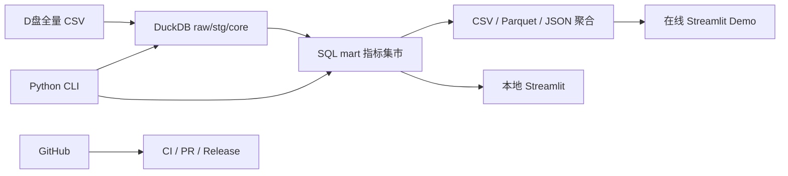

# Product Ops Growth Analytics

基于 Retailrocket 真实电商行为数据的用户增长运营分析作品集：使用 DuckDB SQL 管理全量 CSV，使用 Python 自动重算指标，并通过 Streamlit 展示漏斗、留存、生命周期分群和品类机会。

> 当前状态：[`v0.1.0 — 项目地基 / Project Foundation`](https://github.com/Guzdey/product-ops-growth-analytics/releases/tag/v0.1.0)
> 已于北京时间 2026-08-12 正式发布。注释标签 `v0.1.0` 指向受保护 `main` 的提交
> [`9b97914`](https://github.com/Guzdey/product-ops-growth-analytics/commit/9b979140c40f955f9a42eb7b72782c0e7de0c14b)，
> 对应 [PR #2](https://github.com/Guzdey/product-ops-growth-analytics/pull/2) 的 squash 合并结果。
> 最终发布提交的 [GitHub Actions Run `31498578803`](https://github.com/Guzdey/product-ops-growth-analytics/actions/runs/31498578803)
> 成功完成：总耗时 51 秒，`Python 3.12 quality gate` 作业耗时 46 秒。
> 本版仅为工程地基，不含全量数据仓库、正式运营指标或业务看板；正式业务结论将在后续里程碑完成，
> 本页不预填未经验证的提升数字。

## 项目要回答的问题

1. `view → addtocart → transaction` 的主要流失发生在哪一步？
2. 哪些首个会话行为与更高的 D7/D14 留存或购买意愿相关？
3. 哪些品类具有较大流量和购买意向，却存在明显的转化缺口？
4. 针对关键人群应采取什么运营动作，又应如何通过实验验证？

项目最终交付的不只是 KPI 看板，而是一条可面试讲述的闭环：

```text
业务问题 → 数据口径 → SQL 指标 → 真实发现 → 用户分群 → 运营动作 → 实验验证
```

## 数据概况

正式分析使用 Retailrocket 官方 Kaggle 数据：

- `events.csv`：2,756,101 条匿名访客行为事件；
- `item_properties_part1.csv` + `item_properties_part2.csv`：20,275,902 条商品属性历史；
- `category_tree.csv`：1,669 条分类父子关系；
- 解压 CSV 合计约 987.5 MB，原始 ZIP 约 304.7 MB；
- 原始数据只保存在本地 D 盘，不上传 GitHub。

Full mode 的唯一正式输入是以下四个官方完整文件：

```text
D:\CodexData\product-ops-growth-analytics\raw\extracted\events.csv
D:\CodexData\product-ops-growth-analytics\raw\extracted\item_properties_part1.csv
D:\CodexData\product-ops-growth-analytics\raw\extracted\item_properties_part2.csv
D:\CodexData\product-ops-growth-analytics\raw\extracted\category_tree.csv
```

`raw_data_dir` 可以为其他使用者调整到 D 盘数据根目录内的专用子目录，
但文件契约仍必须是上述四个官方完整 CSV；自定义路径不允许把样例数据冒充为 Full mode。

仓库现有 `outputs/retailrocket_sample/` 与两个 `tools/build_retailrocket_*` 样例脚本会被保留，只用于教学、认识字段和预览 Excel/CSV 格式；它们不会进入正式指标、正式看板或业务结论。

数据来源：[Retailrocket ecommerce dataset](https://www.kaggle.com/datasets/retailrocket/ecommerce-dataset)。数据许可为 [CC BY-NC-SA 4.0](https://creativecommons.org/licenses/by-nc-sa/4.0/)，详细边界见 [数据许可说明](docs/DATA_LICENSE.md)。

## 技术联动



- **DuckDB SQL**：保存分层模型，完成大表连接、会话化、漏斗、留存和聚合；SQL 是指标公式唯一来源。
- **Python**：提供 `ingest`、`build`、`metrics`、`validate`、`export`、`run-all` CLI，负责流程编排、质量门禁、统计检验和导出。
- **Streamlit + Plotly**：读取指标集市或小型聚合文件，呈现运营问题、洞察、策略和验证方案。
- **GitHub Actions**：运行依赖一致性、代码质量、单元测试、SQL lint、六命令 CLI 和真实 Streamlit AppTest；CI 不下载全量数据。`v0.1.0` 使用临时确定性配置，数据仓库阶段再加入并实际消费小型合成 CSV Fixture。

## 存储规则

源码工作区：

```text
C:\Users\18450\Desktop\analysis_ project
```

大型数据根目录：

```text
D:\CodexData\product-ops-growth-analytics
├── raw\
│   ├── retailrocket-ecommerce-dataset.zip
│   └── extracted\
├── warehouse\
├── parquet\
├── tmp\
└── exports\
```

代码通过环境变量读取数据根目录，不依赖用户名写死路径：

```powershell
$env:PRODUCT_OPS_DATA_HOME = 'D:\CodexData\product-ops-growth-analytics'
```

## 本地开发

要求 Python 3.12。为节省 C 盘空间，建议把虚拟环境和 pip 缓存放在 D 盘：

先运行 `py -3.12 --version` 确认 Python 3.12 launcher 可用；如果不可用，先安装官方 Python 3.12，或让 Codex 定位当前环境中已有的 Python 3.12 解释器。

```powershell
py -3.12 -m venv 'D:\CodexData\product-ops-growth-analytics\envs\product-ops-growth-analytics'
& 'D:\CodexData\product-ops-growth-analytics\envs\product-ops-growth-analytics\Scripts\Activate.ps1'
$env:PIP_CACHE_DIR = 'D:\CodexData\product-ops-growth-analytics\cache\pip'
python -m pip install --upgrade pip
python -m pip install -r requirements-dev.txt
```

检查 CLI：

```powershell
python -m product_ops --help
python -m product_ops ingest --help
python -m product_ops build --help
python -m product_ops metrics --help
python -m product_ops validate --help
python -m product_ops export --help
python -m product_ops run-all --help
```

启动 `v0.1.0` 安全占位页（当前不会读取原始 CSV 或数据库）：

```powershell
python -m streamlit run app/streamlit_app.py
```

这些子命令在 `v0.1.0` 提供稳定接口；全量导入与指标行为将分别在 `v0.2.0`、`v0.3.0` 实现。以命令自身的 `--help` 为最终参数说明。

## 验证

```powershell
python -m pip check
python -m ruff check src tests app
python -m pytest
python -m sqlfluff lint sql --ignore-local-config --config .sqlfluff
```

每个里程碑必须通过对应测试和 GitHub Actions，才能创建版本标签与 Release。详细验收条件见 [项目总计划](docs/PROJECT_PLAN.md)，当前状态见 [项目进度](docs/PROGRESS.md)。

## 数据解释边界

- “新增用户”只能表述为观察窗口内首次出现的访客，不能等同于注册用户。
- 订单数使用唯一 `transactionid`，不能用交易事件行数代替。
- 只有 `categoryid`、`available` 可以直接解释；匿名商品属性不能猜测为价格、品牌或名称。
- Retailrocket 没有真实金额、渠道成本或实验分组，因此真实数据层不计算 GMV、AOV、CAC、ROAS 或 LTV。
- `v0.5.0` 的渠道与 A/B 模块完全使用模拟数据，所有输出均标记 `data_origin='synthetic'` 和“模拟数据”。

## 版本路线

| 版本 | 里程碑 | 主要交付 |
|---|---|---|
| `v0.1.0` | 项目地基 | Python 骨架、CLI、AGENTS、配置、测试、CI、GitHub 仓库 |
| `v0.2.0` | SQL 数据仓库 | 全量导入、五层 Schema、会话、交易、SCD2、分类树 |
| `v0.3.0` | 自动运营指标 | 活跃、漏斗、留存、复购、分群、品类机会 |
| `v0.4.0` | 看板与真实洞察 | Streamlit、三条业务故事、运营策略矩阵 |
| `v0.5.0` | 模拟增长实验 | 渠道成本、A/B 测试、统计显著性，独立标记模拟数据 |
| `v1.0.0` | 求职作品集 | 在线演示、案例报告、面试稿、简历描述和稳定 Release |

## 仓库内容与许可

- 原创代码采用 [MIT License](LICENSE)。
- Retailrocket 数据与受其许可约束的衍生物不属于 MIT 授权范围，遵循 CC BY-NC-SA 4.0。
- GitHub 仓库不提供全量数据下载；使用者应从官方页面自行获取并放到配置的数据目录。
- 贡献或自动化 Agent 必须遵守 [AGENTS.md](AGENTS.md)，尤其是数据边界和分步 Git 授权规则。
