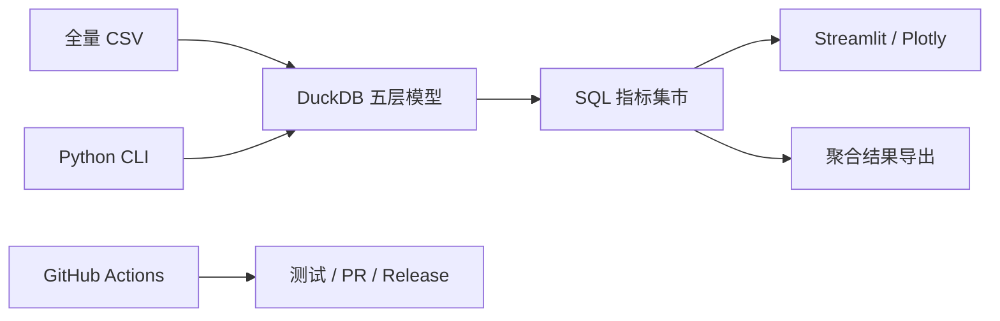

# Product Ops Growth Analytics

> **Product Operations × User Growth × Analytics Engineering**

基于 Retailrocket 真实电商行为数据的产品运营与用户增长分析项目。项目围绕用户活跃、
`view → addtocart → transaction` 转化漏斗、Cohort 留存、复购、生命周期分群和品类机会，
使用 DuckDB SQL 建模，使用 Python 编排与验证指标，并通过 Streamlit 呈现分析结果。

**English summary:** A reproducible product-operations analytics project that turns anonymous
e-commerce behavioral data into governed metrics, user segments, operational actions, and
testable growth hypotheses.

> **当前状态：** `v0.2.0 — Full DuckDB Warehouse` 已通过全量数据验收；
> [PR #5](https://github.com/Guzdey/product-ops-growth-analytics/pull/5) 已合入受保护的
> `main`，合并后 CI 已通过。目前待创建版本标签和 Release，正式运营指标与完整看板
> 将在后续版本实现。

## 项目概览

| 项目要素 | 内容 |
|---|---|
| 业务场景 | 匿名电商访客从浏览、加购到购买及后续回访的运营分析 |
| 数据规模 | 2,756,101 条行为事件、20,275,902 条商品属性历史、1,669 条分类关系 |
| 核心问题 | 漏斗流失、首访质量、留存、复购、生命周期分群和品类机会 |
| 分析方法 | 会话化、严格有序漏斗、Cohort、时态属性关联和数据质量检查 |
| 技术栈 | DuckDB SQL、Python 3.12、Streamlit、Plotly、Pytest、GitHub Actions |

```text
业务问题 → 数据口径 → SQL 指标 → 真实发现 → 用户分群 → 运营动作 → 实验验证
```

## 运营场景

| 运营问题 | 分析方法 | 支持的决策 |
|---|---|---|
| 用户在哪一步流失？ | 严格有序会话漏斗、同商品漏斗 | 确定浏览、加购或购买环节的优化优先级 |
| 哪类首访用户更值得运营？ | 首个会话行为、D1/D7/D14 留存 | 区分仅浏览、加购未购、首购和复购人群 |
| 哪些品类值得优化？ | 浏览规模、品类转化率、同级基准 | 识别高流量但转化偏弱的品类 |
| 运营动作是否有效？ | 核心指标、护栏指标和实验设计 | 验证策略效果，避免把相关性写成因果关系 |

以上是分析框架，不是预设结论。正式发现只会在全量 SQL、质量检查和指标测试通过后发布。

## 实现范围与状态

| 状态 | 内容 |
|---|---|
| 已完成 | 工程地基；全量 CSV 导入；`meta/raw/stg/core` 分层仓库；会话、交易、时态属性与分类模型；质量门禁 |
| 下一步 | 建设 SQL 指标集市，并由 Python 自动计算漏斗、留存、复购、分群和品类指标 |
| 后续计划 | Streamlit 看板、真实运营故事、独立模拟实验和公开部署 |

## 数据与边界

正式分析使用 [Retailrocket ecommerce dataset](https://www.kaggle.com/datasets/retailrocket/ecommerce-dataset)：

- `events.csv`：2,756,101 条匿名访客行为事件；
- 两份 `item_properties`：合计 20,275,902 条商品属性历史；
- `category_tree.csv`：1,669 条分类关系；
- 解压 CSV 合计约 987.5 MB，原始数据只保存在本地，不上传 GitHub。

关键解释边界：

- “新增”仅指观察窗口内首次出现的访客，不等同于注册用户；
- 订单数使用唯一 `transactionid`，不能用交易事件行数代替；
- 只有 `categoryid`、`available` 可以直接解释，其他商品属性保持匿名；
- 数据没有真实金额、渠道成本或实验分组，因此不计算真实 GMV、AOV、CAC、ROAS 或 LTV；
- 仓库内教学样例只用于字段学习，不参与正式指标或业务结论。

数据与衍生物遵循 [CC BY-NC-SA 4.0](docs/DATA_LICENSE.md)。

## 技术架构



- **DuckDB SQL**：负责大表连接、会话化、时态属性关联和指标聚合；
- **Python**：负责配置、流程编排、质量检查、统计检验和导出；
- **Streamlit + Plotly**：读取聚合结果并展示分析、策略与验证方案；
- **GitHub Actions**：执行代码、SQL、CLI、测试和敏感文件检查。

SQL 是指标公式的唯一来源，Python 不重复维护第二套指标口径。

## 本地运行

要求 Python 3.12。安装依赖：

```powershell
python -m pip install -r requirements-dev.txt
```

查看 CLI：

```powershell
python -m product_ops --help
```

从官方完整 CSV 构建并验证数据仓库：

```powershell
python -m product_ops.cli ingest --config config\project.example.toml
python -m product_ops.cli build --config config\project.example.toml
python -m product_ops.cli validate --config config\project.example.toml --json
```

也可以依次执行全部步骤：

```powershell
python -m product_ops.cli run-all --config config\project.example.toml --json
```

启动当前项目页面：

```powershell
python -m streamlit run app/streamlit_app.py
```

数据库和完整质量报告写入 D 盘数据目录，不进入 GitHub。当前页面只展示项目阶段说明，
不会直接扫描完整 CSV；正式指标和业务图表将在 `v0.3.0`、`v0.4.0` 增加。

运行验证：

```powershell
python -m pip check
python -m ruff check src tests app
python -m pytest
python -m sqlfluff lint sql --ignore-local-config --config .sqlfluff
```

## 文档与许可

- [数据契约](docs/DATA_CONTRACT.md)：字段、表关系和质量规则；
- [数据仓库使用说明](docs/WAREHOUSE_GUIDE.md)：技术联动、执行命令和关键口径；
- [`v0.2.0` 全量数据质量摘要](docs/V0.2_QUALITY_REPORT.md)：行数、异常、性能和局限；
- [运营指标字典](docs/METRIC_DICTIONARY.md)：指标公式、粒度和限制；
- [项目计划](docs/PROJECT_PLAN.md)与[当前进度](docs/PROGRESS.md)；
- [`v0.1.0` Release](https://github.com/Guzdey/product-ops-growth-analytics/releases/tag/v0.1.0)；
- 原创代码采用 [MIT License](LICENSE)，Retailrocket 数据不属于 MIT 授权范围。
